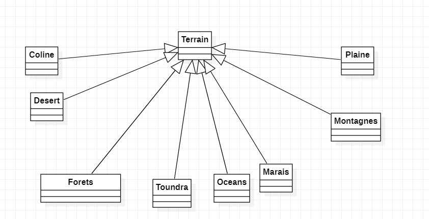

<h1>Bruit de perlin</h1>

Le bruit de perlin est une fonction mathématique qui permet de générer des images aléatoires. Il est utilisé dans les jeux vidéos pour générer des terrains aléatoires. Il est aussi utilisé dans les films pour générer des textures.

<h2> Question du sujet </h2>
<h4>Q1.</h4>

L'attribut graine est en final car une fois que la graine à été défini il ne faut pas qu'elle puisse être modifier

<h4>Q2.</h4>

Il n'y aurait aucune différence d'attributs

C'est une très mauvaise idée d'utiliser cette modélisation,en effet elle ne respecte pas les principe ouvert/fermer 
et rend la maintenance difficile. Le mieux serait d'utiliser un pattern visiteur .

